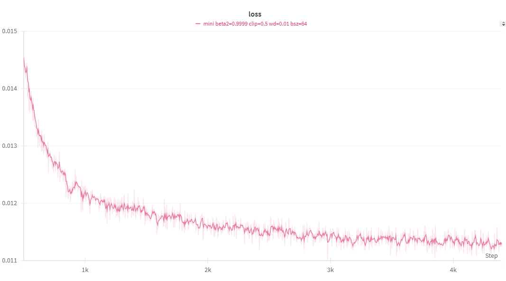

# RWKV-15PUZZLE

A specialized RWKV model for solving 15 Puzzle

## Requirements

- rwkv
- tkinter

## Quick Start

- Run `demo.py` or `minimum_inference.py`

## Model

The current model is a specialized RWKV-v6 model trained on 500k 15-puzzle samples (~2.3B tokens) specifically for solving 15 puzzle puzzles.

Model specifications:
- Parameters: ~4M
- Vocabulary size: 83
- Architecture: 4 layers, 256 dimensions

The model includes a simple improvement for better performance (see `model.py` line 372). Corresponding modifications were made in the inference code (`rwkv_model.py` lines 852, 893-896).

## Training

The model was trained using the [RWKV-LM](https://github.com/BlinkDL/RWKV-LM) repository.

Hyperparameters:
- `M_BSZ`: 64
- `CTX_LEN`: 8192
- `LR`: 8e-4 to 3e-5
- `ADAM_EPS`: 1e-18
- `ADAM_BETA1`: 0.9
- `ADAM_BETA2`: 0.9999
- `WEIGHT_DECAY`: 0.01

